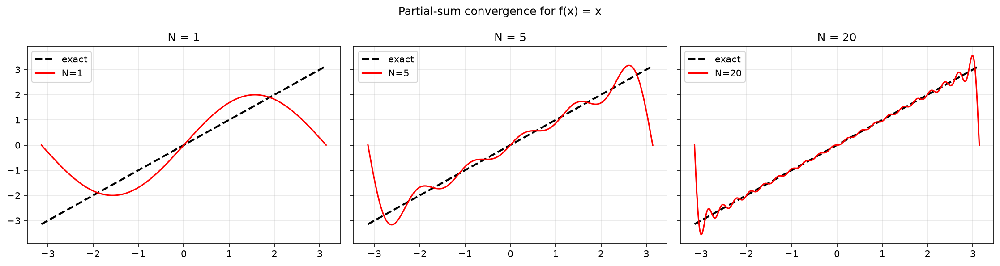
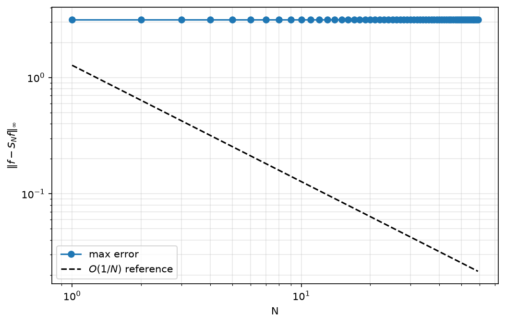
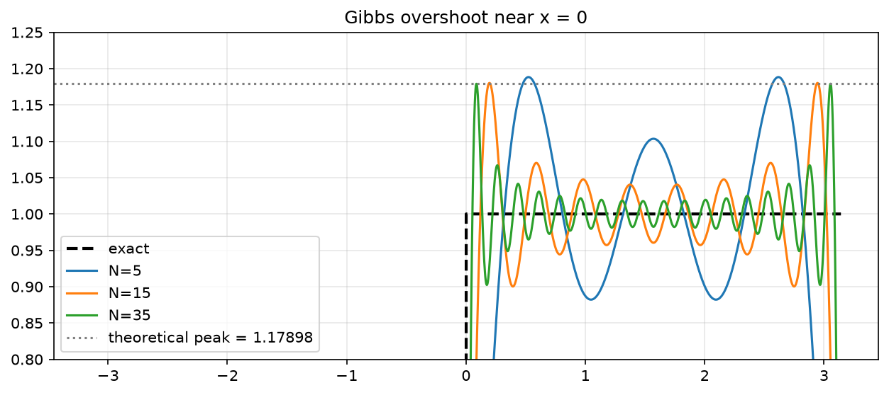
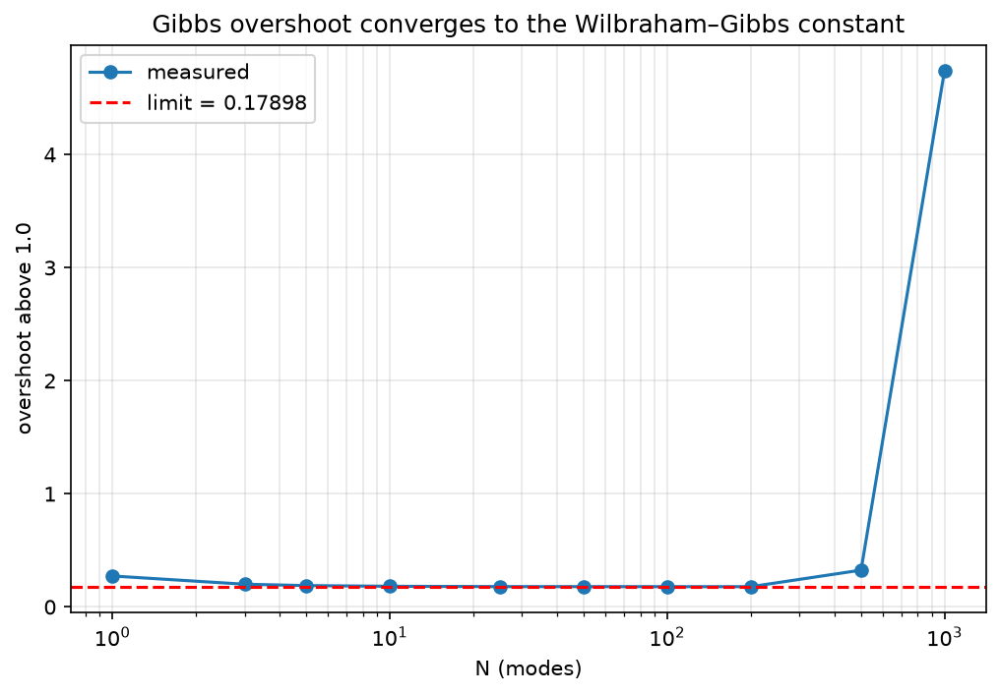
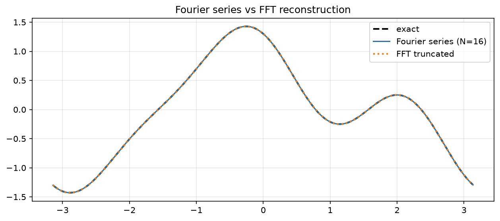
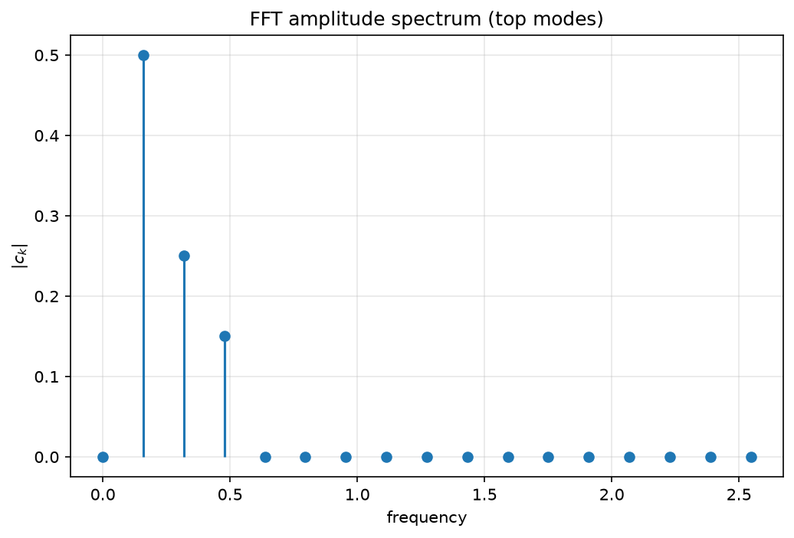
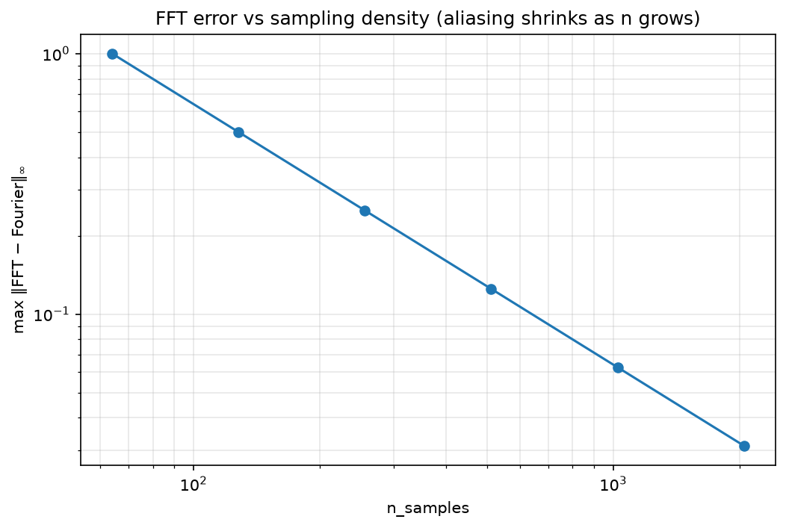

# Fourier Series and Signal Reconstruction Analysis

[](https://www.python.org/)
[](https://numpy.org/)
[](https://scipy.org/)
[](https://github.com/BrokerRecord/fourier-series-analysis/actions/workflows/ci.yml)
[](LICENSE)

A self-contained study of **Fourier series**, their **convergence**, and the
**Gibbs phenomenon**, with a numerical comparison against the **FFT**.

The project covers the classical chain of ideas — orthogonality → Fourier
coefficients → partial-sum convergence → jump discontinuities → discrete
counterparts — and quantifies each step with reproducible figures and unit
tests.

---

## Highlights

- **Analytical Fourier coefficients** via Gauss–Kronrod quadrature, with
  orthogonality verified numerically to machine precision.
- **Convergence study** of partial sums: pointwise error decay for a sawtooth
  and empirical confirmation of the $O(1/N)$ rate at a jump.
- **Gibbs phenomenon**: measured overshoot converges to the
  Wilbraham–Gibbs constant $(2/\pi)\,\mathrm{Si}(\pi) - 1 \approx 0.17898$
  in absolute terms — i.e. **8.95 % of the jump size**.
- **Analytical Fourier series vs. FFT**: agreement to $\sim 10^{-15}$ for smooth
  signals, and a quantified aliasing study for a square wave.
- **Unit tests** validating coefficients, symmetry, and the Gibbs limit.

---

## Project structure

```
fourier-series-analysis/
├── src/
│   ├── __init__.py
│   ├── fourier.py              # FourierSeries class (coeffs + reconstruct)
│   ├── gibbs_analysis.py       # Gibbs overshoot measurement
│   └── signal_processing.py    # Fourier series vs FFT comparison
├── notebooks/
│   ├── 01_fourier_coefficients.ipynb
│   ├── 02_gibbs_phenomenon.ipynb
│   └── 03_fourier_vs_fft.ipynb
├── tests/
│   └── test_fourier.py         # pytest unit tests
├── figures/                    # PNG outputs referenced below
├── pyproject.toml
├── LICENSE
└── README.md
```

---

## Mathematical background

On $[-L, L]$, the real Fourier series of $f$ is

$$
f(x) \;\sim\; \frac{a_0}{2} \;+\; \sum_{n=1}^{\infty}
\Bigl[\, a_n \cos\!\Bigl(\tfrac{n\pi x}{L}\Bigr)
     + b_n \sin\!\Bigl(\tfrac{n\pi x}{L}\Bigr) \,\Bigr],
$$

with coefficients

$$
a_n = \frac{1}{L}\int_{-L}^{L} f(x)\cos\!\Bigl(\tfrac{n\pi x}{L}\Bigr)\,dx,
\qquad
b_n = \frac{1}{L}\int_{-L}^{L} f(x)\sin\!\Bigl(\tfrac{n\pi x}{L}\Bigr)\,dx.
$$

The basis $\{1, \cos(n\pi x/L), \sin(n\pi x/L)\}$ is orthogonal on $[-L, L]$;
this is verified numerically in notebook 01.

For a jump discontinuity, the partial sums $S_N f$ overshoot the plateau by
a fixed fraction of the jump. The **absolute** Wilbraham–Gibbs constant is

$$
G_{\text{abs}} \;=\; \frac{2}{\pi}\,\mathrm{Si}(\pi) - 1 \;\approx\; 0.178980,
$$

which — relative to a jump of size $2$ — is the classical **$8.95\,\%$**
figure. The **fractional** constant is

$$
G_{\text{frac}} \;=\; \frac{G_{\text{abs}}}{2}
\;=\; \frac{1}{\pi}\,\mathrm{Si}(\pi) - \frac{1}{2} \;\approx\; 0.0894898.
$$

---

## Results

### 1. Orthogonality of the trigonometric basis

Numeric inner products (Gauss–Kronrod) match the analytic values exactly to
machine precision:

| inner product                   | numeric              | expected  |
| ------------------------------- | -------------------- | --------- |
| $\langle \cos 1, \cos 2\rangle$ | $-2.8\times10^{-16}$ | $0$       |
| $\langle \sin 1, \sin 3\rangle$ | $-8.7\times10^{-17}$ | $0$       |
| $\langle \cos 1, \sin 1\rangle$ | $0$                  | $0$       |
| $\langle \cos 1, \cos 1\rangle$ | $3.14159\ldots$      | $\pi = L$ |

### 2. Convergence of partial sums

For the sawtooth $f(x) = x$ on $[-\pi, \pi]$ (with $a_0 = a_n = 0$ and
$b_n = 2(-1)^{n+1}/n$), partial sums converge pointwise away from the jump:



The $L^\infty$ error decays like $O(1/N)$, as expected for a function with a
jump discontinuity:



### 3. The Gibbs phenomenon

For a square wave, partial sums overshoot the jump by a fixed fraction of the
step height. The overshoot does **not** vanish as $N \to \infty$ — only its
width shrinks:



Measuring the peak overshoot for increasing $N$ confirms convergence to the
**absolute** Wilbraham–Gibbs constant for a unit-amplitude square wave,

$$
G_{\text{abs}} \;=\; \frac{2}{\pi}\,\mathrm{Si}(\pi) - 1 \;\approx\; 0.178980,
$$

which equals $8.95\%$ of the jump size:



The peak location scales like $\pi/N$ — the overshoot narrows but does not
shrink, even at $N = 1000$:

| $N$  | peak location $x^\star$ | $1 + G_{\text{abs}}$ |
| ---- | ----------------------- | -------------------- |
| 10   | $0.314175$              | $1.182328$           |
| 50   | $0.062835$              | $1.179113$           |
| 200  | $0.015709$              | $1.178988$           |
| 1000 | $0.003142$              | $1.178980$           |

### 4. Analytical Fourier series vs. FFT

For a smooth signal, the truncated FFT reconstruction agrees with the
analytical Fourier series to machine precision
($\max|\text{FFT} - \text{FS}| \approx 3.2\times10^{-15}$):



The FFT spectrum of the top modes confirms the expected frequencies:



For a **jump** function, the FFT suffers from finite-sampling aliasing. The
discrepancy shrinks as the number of samples grows, as quantified by the
following convergence study:



---

## Installation

```bash
git clone https://github.com/<your-username>/fourier-series-analysis.git
cd fourier-series-analysis
python -m venv .venv && source .venv/bin/activate    # Windows: .venv\Scripts\activate
pip install -e .
```

For the notebook and test workflow:

```bash
pip install -e ".[dev]"
jupyter lab
```

---

## Usage

### Fourier coefficients and reconstruction

```python
import numpy as np
from src.fourier import FourierSeries

fs = FourierSeries(lambda x: x, L=np.pi)
a0, an, bn = fs.compute_coefficients(n_modes=10)
print("a0 =", a0, "| a1 =", an[0], "| b1 =", bn[0])

x = np.linspace(-np.pi, np.pi, 1000)
y = fs.reconstruct(x, n_modes=20)
```

For functions with a **known jump**, pass the breakpoint to help the
quadrature:

```python
y = fs.reconstruct(x, n_modes=20, breakpoints=[0.0])
```

### Gibbs overshoot study

```python
from src.gibbs_analysis import (
    analyze_gibbs_overshoot,
    theoretical_gibbs_constant,
    theoretical_gibbs_fraction,
)

result = analyze_gibbs_overshoot([10, 50, 100, 500, 1000])
print("absolute limit:", result["theoretical_limit"])   # 0.178980
print("fractional    :", theoretical_gibbs_fraction())  # 0.089490
print("overshoots    :", result["overshoots"])
```

### Fourier series vs. FFT

```python
from src.signal_processing import compare_fourier_vs_fft

out = compare_fourier_vs_fft(
    lambda x: np.cos(x) + 0.3 * np.cos(3 * x) - 0.5 * np.sin(2 * x),
    L=np.pi, n_samples=1024, n_modes=16,
)
err = np.max(np.abs(out["fourier_series"] - out["fft_reconstruction"]))
print(f"max |FS - FFT| = {err:.2e}")
```

---

## Notebooks

| #   | Notebook                                                                   | Contents                                                                                   |
| --- | -------------------------------------------------------------------------- | ------------------------------------------------------------------------------------------ |
| 01  | [`01_fourier_coefficients.ipynb`](notebooks/01_fourier_coefficients.ipynb) | Orthogonality, coefficient derivation, convergence of partial sums, $L^\infty$ error decay |
| 02  | [`02_gibbs_phenomenon.ipynb`](notebooks/02_gibbs_phenomenon.ipynb)         | Gibbs overshoot, convergence to the Wilbraham–Gibbs constant, peak-location scaling        |
| 03  | [`03_fourier_vs_fft.ipynb`](notebooks/03_fourier_vs_fft.ipynb)             | Analytical series vs. FFT on smooth signals, aliasing on a jump, sampling-density sweep    |

Each notebook ends with an **exercise** section suggesting extensions
(Fejér means, sawtooth overshoot, denoising).

---

## Tests

Run the unit test suite with:

```bash
pytest -v
```

All ten tests pass. They cover:

- **`test_sine_wave_coefficients`** — a pure $\sin(x)$ input returns
  $b_1 = 1$ and zeros elsewhere.
- **`test_square_wave_odd_symmetry`** — the square wave has $a_n = 0$
  everywhere and $b_n = 4/(n\pi)$ for odd $n$, $0$ for even $n$.
- **`test_gibbs_theoretical_constant_absolute`** — the absolute Wilbraham–Gibbs
  constant evaluates to $\approx 0.178980$.
- **`test_gibbs_theoretical_constant_fractional`** — the classical $8.95\%$
  figure evaluates to $\approx 0.0894898$.
- **`test_gibbs_constants_consistency`** — the two constants are related by a
  factor of exactly $2$.
- **`test_gibbs_overshoot_converges_to_limit`** — the measured overshoot
  approaches the theoretical absolute limit as the mode count increases.
- **`test_gibbs_overshoot_monotone_approach`** — the gap to the limit shrinks monotonically in magnitude.
- **`test_compare_fourier_vs_fft_smooth_agreement`** — FS and FFT reconstructions agree to machine precision on a smooth signal.

- **`test_compare_fourier_vs_fft_returned_keys`** — the returned dict exposes the exact keys the notebooks rely on.

- **`test_compare_fourier_vs_fft_aliasing_decreases`** — for a jump signal, the FS–FFT discrepancy shrinks as n_samples grows.

---

## Requirements

- Python ≥ 3.10
- numpy ≥ 1.24
- scipy ≥ 1.10
- matplotlib ≥ 3.7
- pytest ≥ 7.4 _(dev)_
- jupyter ≥ 1.0 _(dev)_

---

## Author

**Awa Mbaye** — [Evash0uwha@gmail.com](mailto:Evash0uwha@gmail.com)

## License

Released under the MIT License. See [`LICENSE`](LICENSE) for details.
